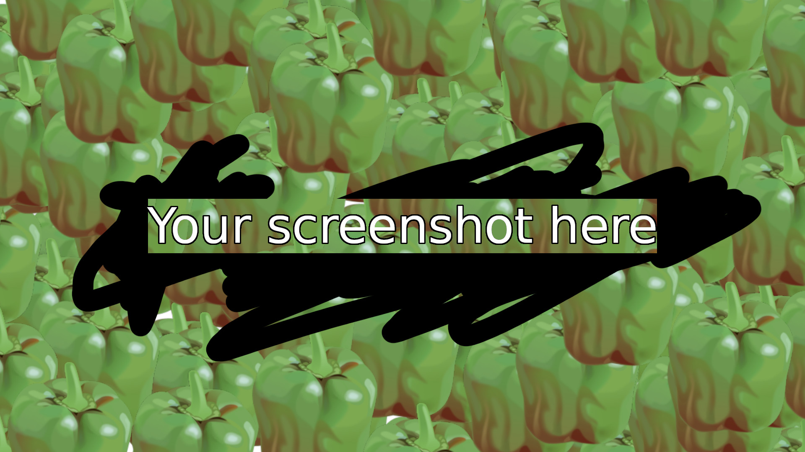

# SoarCS 2019!

<!-- Note, the line below this one is what links to your screenshot, **DO NOT REMOVE** -->

<!--
In this file, you should write a brief description of what your
project is, what you learned, and a simple screenshot of your work.

To add a screenshot, please replace `screenshot.png` with
your own screenshot.
-->

## My project

We will program Cozmo to use a pen to draw a picture. We plan to put a pen in Cozmo's hand and have it draw a city sky outline.
